# Agentic Video Assistant

<p align="center">
  
  
  
  
</p>

<p align="center">
  <strong>Turn a simple idea into an AI-generated video.</strong>
</p>

<p align="center">
  An agentic AI application that researches ideas, improves video prompts,
  submits generation requests, monitors the generation process,
  and returns the final video.
</p>

---

## Overview

**Agentic Video Assistant** is a modular AI application built around an autonomous agent.

Instead of manually performing several steps, the user provides a simple idea and the agent coordinates the workflow.

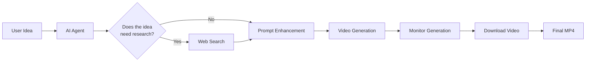

### Example

**Input**

> Create an eerie cinematic video about the fear of being alone in the dark.

**The system**

```text
Idea
 ↓
Agent
 ↓
Prompt Enhancement
 ↓
Video API
 ↓
Generation
 ↓
Download
 ↓
MP4
```

---

# Key Features

| Feature              | What it does                                          |
| -------------------- | ----------------------------------------------------- |
| Agentic AI           | Uses an LLM-powered agent to coordinate the workflow  |
| Web Research         | Searches for relevant information when needed         |
| Prompt Enhancement   | Turns simple ideas into detailed video prompts        |
| Video Generation     | Sends prompts to an external video-generation service |
| Job Polling          | Waits for asynchronous video generation to finish     |
| Automatic Download   | Saves the generated video locally                     |
| Gradio UI            | Provides a simple browser interface                   |
| Modular Architecture | Separates AI logic, tools, services and UI            |
| Docker Support       | Ready for container-based deployment                  |
| Testing              | Includes unit tests without requiring real API calls  |

---

# How the System Works

The system can be understood as **five simple stages**.

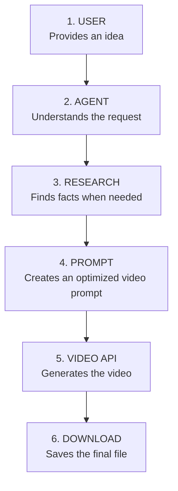

### 1. User

The user describes what they want.

### 2. Agent

The AI interprets the request and decides which tools are useful.

### 3. Research

If the topic requires factual information, the agent can search the web.

### 4. Prompt

The agent transforms the original idea into a richer prompt for the video model.

### 5. Generation

The prompt is sent to the configured video-generation API.

### 6. Download

The system monitors the asynchronous job and downloads the completed video.

---

# System Architecture

The application is divided into independent layers.

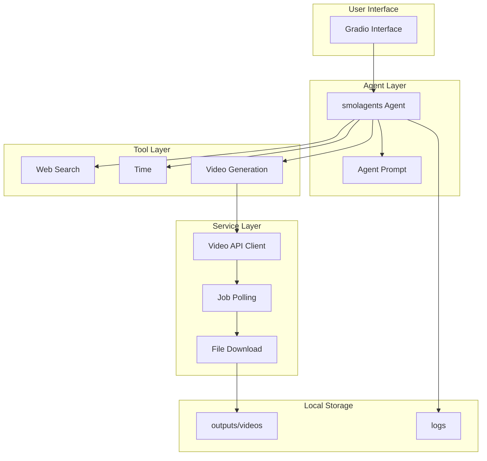

### Why this architecture?

Each part has a specific responsibility.

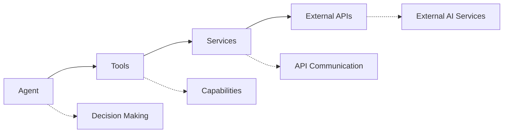

This means an API provider can be replaced without rewriting the agent.

---

# Project Structure

```text
agentic-video-assistant/
│
├── app.py
│
├── agent/
│   ├── __init__.py
│   ├── agent.py
│   └── prompts.py
│
├── tools/
│   ├── __init__.py
│   ├── search.py
│   ├── time.py
│   └── video.py
│
├── services/
│   ├── __init__.py
│   └── agnes.py
│
├── config/
│   ├── __init__.py
│   └── settings.py
│
├── ui/
│   ├── __init__.py
│   └── gradio_app.py
│
├── utils/
│   ├── __init__.py
│   └── logger.py
│
├── tests/
│   ├── test_agent.py
│   ├── test_search.py
│   └── test_video.py
│
├── outputs/
│   └── videos/
│
├── logs/
│
├── .env.example
├── .gitignore
├── Dockerfile
├── requirements.txt
└── README.md
```

---

# Technology Stack

<p align="center">
  
</p>

### AI

* [smolagents](https://github.com/huggingface/smolagents)
* LLM provider through LiteLLM-compatible configuration

### Interface

* Gradio

### Search

* DuckDuckGo

### Video

* External video-generation API
* Asynchronous generation
* Job polling
* Automatic download

### Testing

* Pytest

### Deployment

* Docker
* Railway
* Render
* Other Docker-compatible platforms

---

# Installation

## Requirements

You need:

* Python 3.10+
* Git
* An API key for your LLM provider
* An API key for your video-generation provider

---

## 1. Clone the repository

```bash
git clone https://github.com/YOUR_USERNAME/agentic-video-assistant.git
cd agentic-video-assistant
```

---

## 2. Create a virtual environment

### Linux / macOS

```bash
python -m venv .venv
source .venv/bin/activate
```

### Windows

```powershell
python -m venv .venv
.venv\Scripts\activate
```

---

## 3. Install dependencies

```bash
pip install -r requirements.txt
```

---

# Configuration

Create the environment file.

### Linux / macOS

```bash
cp .env.example .env
```

### Windows

```powershell
copy .env.example .env
```

Then configure:

```env
MODEL_ID=your_model
MODEL_API_KEY=your_llm_api_key

AGNES_API_URL=your_video_api_url
AGNES_API_KEY=your_video_api_key
```

| Variable        | Description                   |
| --------------- | ----------------------------- |
| `MODEL_ID`      | LLM used by the agent         |
| `MODEL_API_KEY` | LLM authentication key        |
| `AGNES_API_URL` | Video-generation API base URL |
| `AGNES_API_KEY` | Video-generation API key      |

> Never commit `.env` or expose API keys in the repository.

---

# Run the Application

Start the application:

```bash
python app.py
```

Then open:

```text
http://localhost:7860
```

---

# Testing

Run:

```bash
python -m pytest tests/ -v
```

The tests are designed to avoid unnecessary real API calls.

---

# Docker

Build:

```bash
docker build -t agentic-video-assistant .
```

Run:

```bash
docker run --env-file .env -p 7860:7860 agentic-video-assistant
```

Then open:

```text
http://localhost:7860
```

---

# Current Capabilities

The current implementation provides this pipeline:

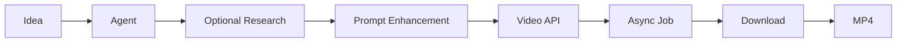

The project therefore already provides the foundation for **agent-driven video generation**.

---

# Audio: What Is Supported?

The current system is primarily a **video-generation pipeline**.

It should **not** be described as a complete audio-production system.

The current implementation does not automatically guarantee:

* Voiceover
* Character voices
* Background music
* Sound effects
* Automatic subtitles
* Audio mixing

These require additional services.

A complete media pipeline would look like this:

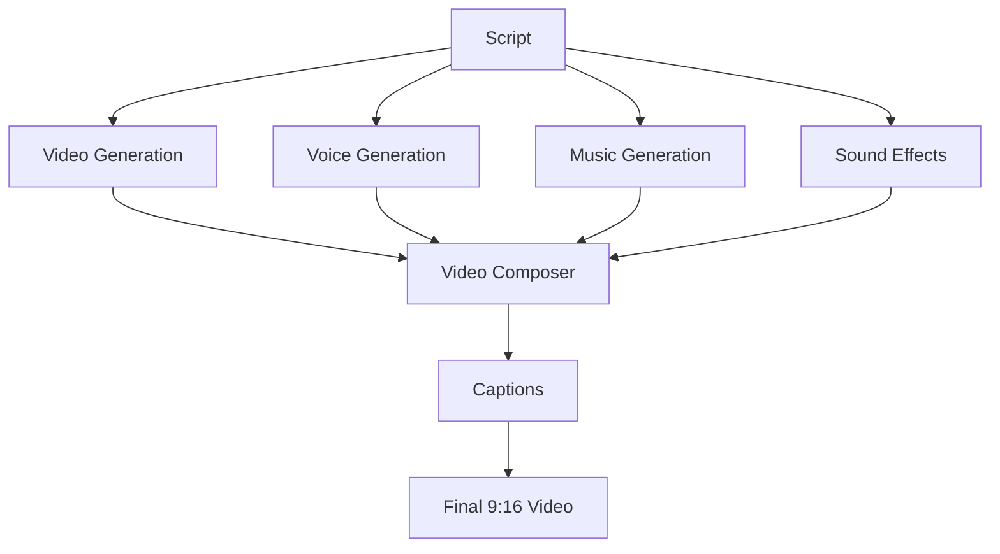

This is the natural next stage of the project.

---

# From Single Agent to Multi-Agent System

The current application can evolve into a specialized multi-agent architecture.

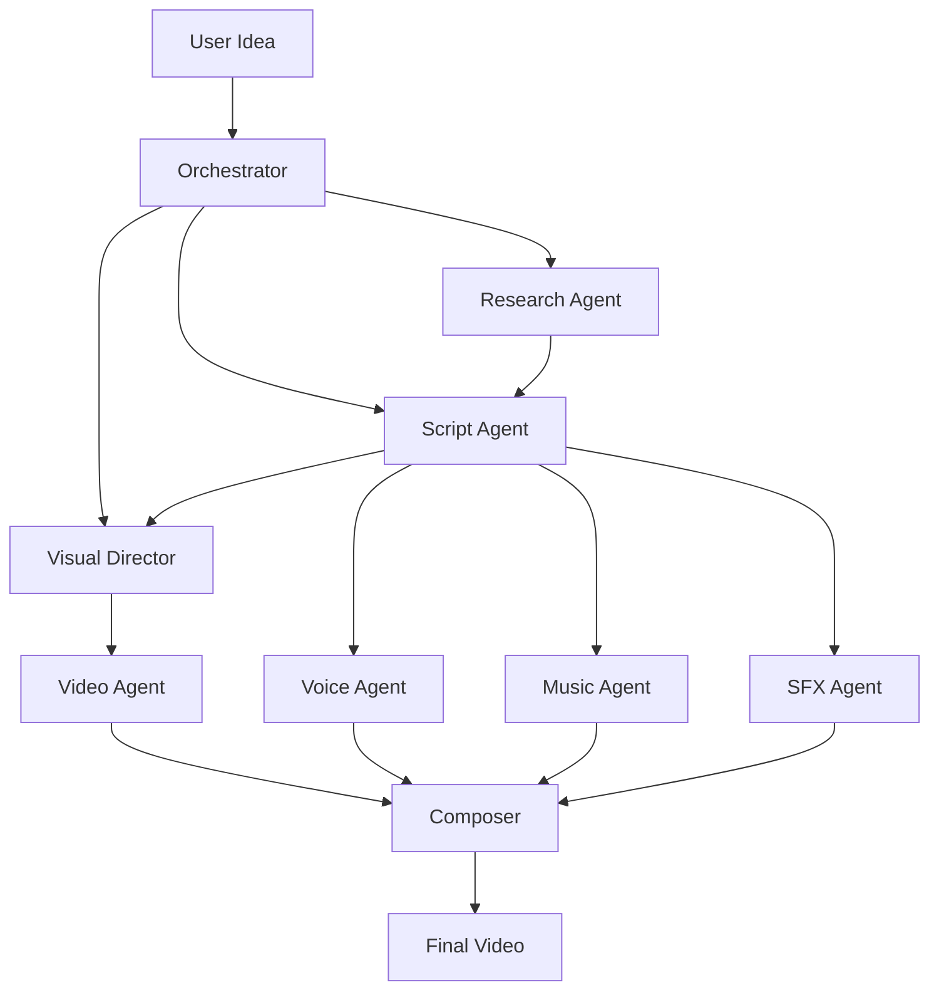

### Specialized agents

**Research Agent**

Finds and verifies information.

**Script Agent**

Creates the hook, narration and story structure.

**Visual Director**

Converts the script into scene-by-scene visual instructions.

**Video Agent**

Handles video generation and provider communication.

**Voice Agent**

Generates narration or character dialogue.

**Music Agent**

Creates or selects background music.

**SFX Agent**

Adds environmental and transition sounds.

**Composer**

Combines everything into the final video.

---

# Example Future Workflow

A user could eventually write:

> Create a 40-second eerie video explaining a strange detail hidden in a Renaissance painting.

The system could transform this into:

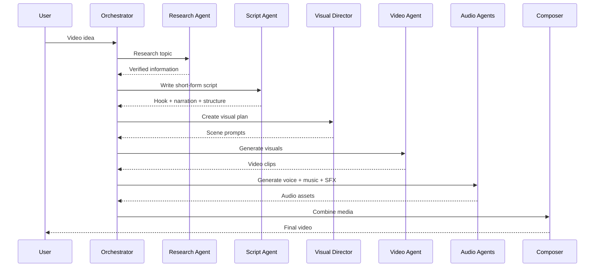

---

# Short-Form Content

The architecture is particularly suitable for content formats such as:

* Art history
* Surrealism
* Philosophy
* Existentialism
* Mythology
* Dark history
* Weirdcore
* Cultural stories
* Experimental storytelling

The system is designed to eventually support short-form formats such as:

```text
9:16
15–60 seconds
Strong opening hook
Fast visual progression
Narration
Music
Sound design
Captions
```

---

# Roadmap

## Core

* [x] Agentic workflow
* [x] Web research
* [x] Prompt enhancement
* [x] Video generation
* [x] Async job polling
* [x] Automatic download
* [x] Gradio interface
* [x] Environment configuration
* [x] Docker support
* [x] Unit tests

## Content Generation

* [ ] Script generation
* [ ] Automatic hooks
* [ ] Style presets
* [ ] Duration controls
* [ ] 9:16 generation mode
* [ ] Scene-by-scene generation
* [ ] Visual consistency

## Audio

* [ ] Text-to-speech
* [ ] Character voices
* [ ] Music generation
* [ ] Sound-effect generation
* [ ] Audio mixing

## Post-Production

* [ ] FFmpeg composition
* [ ] Automatic captions
* [ ] Transitions
* [ ] Music synchronization
* [ ] Audio ducking
* [ ] Final rendering

## Platform

* [ ] Video gallery
* [ ] Persistent history
* [ ] User accounts
* [ ] PostgreSQL
* [ ] Object storage
* [ ] Per-user memory
* [ ] Concurrent users

## Multi-Agent

* [ ] Orchestrator
* [ ] Research Agent
* [ ] Script Agent
* [ ] Visual Director
* [ ] Video Agent
* [ ] Voice Agent
* [ ] Music Agent
* [ ] SFX Agent
* [ ] Composer Agent

---

# Deployment

The project includes a Dockerfile and can be deployed to a Docker-compatible platform.

Possible platforms include:

* Railway
* Render
* Hugging Face Spaces
* Other cloud platforms supporting Docker

Configure secrets through the platform's environment-variable system.

Do not upload `.env`.

For production, the application should also use the platform-provided `PORT` environment variable.

---

# Database

A database is not required for the current prototype.

Generated videos are stored locally:

```text
outputs/videos/
```

Logs are stored in:

```text
logs/
```

For a portfolio or single-user prototype, this is sufficient.

A database becomes useful when adding:

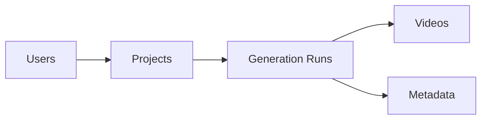

A practical progression is:

```text
SQLite
   ↓
PostgreSQL
   ↓
PostgreSQL + Object Storage
```

---

# API Service Layer

The external video API is isolated inside:

```text
services/agnes.py
```

The architecture is:

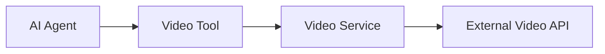

This keeps provider-specific API logic outside the agent.

A different video provider can therefore be integrated by replacing or extending the service layer.

> **Important:** the current `agnes` implementation contains placeholder endpoint paths and response fields. Replace them with the actual API contract of the selected provider before production deployment.

---

# Production Checklist

Before treating the application as a production service:

* [ ] Replace placeholder API endpoints
* [ ] Validate API responses
* [ ] Add request timeouts
* [ ] Add retry logic
* [ ] Handle rate limits
* [ ] Add structured error handling
* [ ] Add per-user state
* [ ] Add persistent storage if required
* [ ] Add cloud/object storage
* [ ] Add file cleanup
* [ ] Configure production logging
* [ ] Test concurrent users
* [ ] Secure all credentials
* [ ] Add audio pipeline if required
* [ ] Add final video composition
* [ ] Add automatic captions

---

# Project Status

| Component          |      Status      |
| ------------------ | :--------------: |
| Agent              |       Ready      |
| Web Search         |       Ready      |
| Prompt Enhancement |       Ready      |
| Video Workflow     |       Ready      |
| Async Polling      |       Ready      |
| Video Download     |       Ready      |
| Gradio UI          |       Ready      |
| Tests              |       Ready      |
| Docker             |       Ready      |
| Database           | Not required yet |
| Voice Generation   |      Planned     |
| Music Generation   |      Planned     |
| SFX Generation     |      Planned     |
| Captions           |      Planned     |
| Video Composition  |      Planned     |
| Multi-Agent System |      Planned     |

---

# Design Philosophy

The project is built around four principles:

### Separation of concerns

Each layer has a clear responsibility.

### Modular providers

External AI services can be replaced without redesigning the entire application.

### Agent-driven orchestration

The LLM determines which tools are useful instead of relying entirely on hard-coded logic.

### Extensibility

The current system provides a foundation for adding research, scripting, audio, visual generation and post-production agents.

---

# Future Vision

The long-term goal is to evolve the project from:

```text
Idea → Video
```

into:

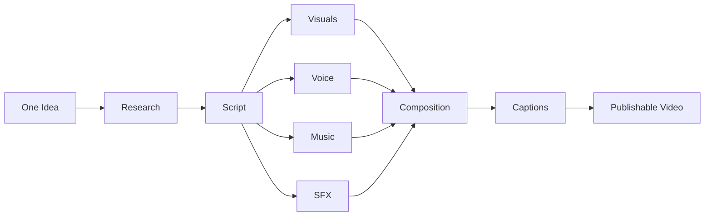

**One idea in. One finished video out.**

---

# Author

<p align="center">

<strong>Nadjiba Rahal</strong><br>
Intelligent Systems & Data Science<br>
École Supérieure d'Informatique — Algiers

<br><br>

<a href="https://github.com/Nadjiba-Rahal">
  
</a>

</p>

---

<p align="center">
  <sub>Built with Python, smolagents, Gradio and generative AI.</sub>
</p>
