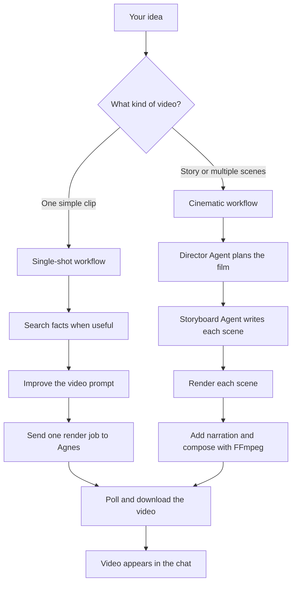
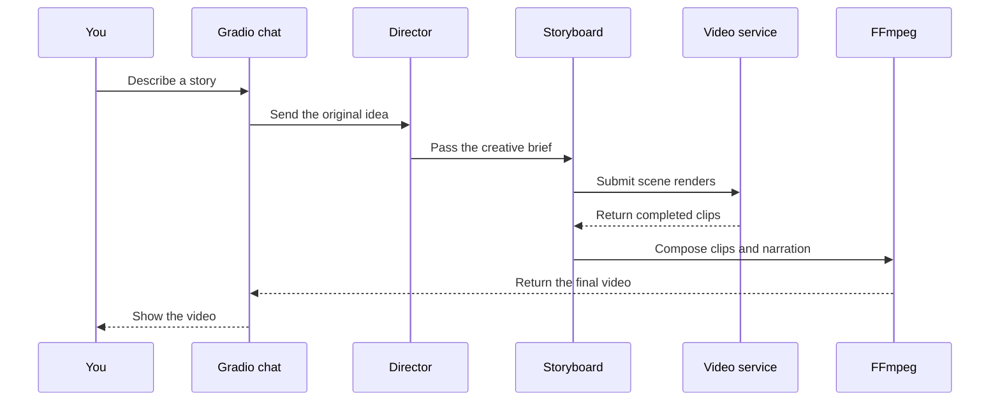
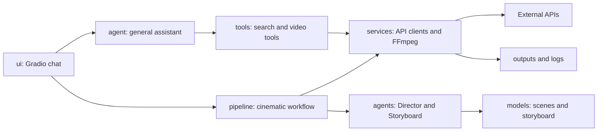

# Agentic Video Assistant

Agentic Video Assistant turns a plain-language idea into a finished video. You describe what you want in the Gradio chat, and the app chooses the right workflow.

It is designed for short creative videos, factual explainers, and cinematic multi-scene stories. The chat window keeps the conversation readable while generated videos stay inside a compact player.

## What happens to a request

## The two workflows

### Single-shot

Use this for one subject, one action, or a short explainer. The general agent can search for facts, improve the wording, call the video service, and return the finished clip.

### Cinematic

Use this for a story, a short film, a storyboard, or several scenes. The Director Agent chooses the structure. The Storyboard Agent turns it into scene prompts, narration, transitions, and sound suggestions. Each scene is rendered, narration is created, and FFmpeg assembles the final video.

## Start here

The project needs Python, FFmpeg, an LLM provider key, and credentials for the Agnes video service.

1. Open the project folder in VS Code.
2. Create a virtual environment named `.venv` with Python 3.11 or 3.13. Python 3.14 is not supported by the current Gradio audio dependencies.
3. Install the dependencies listed in `requirements.txt`.
4. Copy `.env.example` to `.env`.
5. Add your provider credentials to `.env`.
6. Start `app.py` with the Python executable inside `.venv`.
7. Open the local address printed by Gradio, normally `http://localhost:7860`.

The app also chooses another free port when the default port is busy.

## Configuration

The current working Groq setup uses the `openai/gpt-oss-20b` model exposed through Groq. The model name belongs in `MODEL_ID`; the Groq secret belongs in `MODEL_API_KEY` and `GROQ_API_KEY`.

The Director and Storyboard agents normally use the same model. Their optional model settings can override it independently.

The video service needs `AGNES_API_URL`, `AGNES_API_KEY`, and `AGNES_MODEL`. Keep all secrets in `.env`. Never commit `.env`, paste keys into issues, or include keys in screenshots. If a key is exposed, revoke it and create a replacement immediately.

Search does not need an API key. FFmpeg must be installed and available on your PATH when running locally; the Docker image installs it automatically.

## Project map

The main folders have one responsibility each:

- `agent/` contains the general chat agent and its model setup.
- `agents/` contains the Director and Storyboard planning agents.
- `models/` contains the structured scene and storyboard data.
- `pipeline/` coordinates cinematic planning, rendering, narration, and composition.
- `tools/` exposes safe actions to the general agent.
- `services/` handles Agnes, polling, voice generation, and FFmpeg.
- `config/` is the single source of truth for settings and defaults.
- `ui/` contains the Gradio interface.
- `tests/` contains offline tests that do not call paid services.
- `outputs/videos/` stores generated clips and completed runs.
- `outputs/scripts/` stores cinematic shooting scripts.
- `logs/` stores application logs.

## Files created after a cinematic run

Each run receives a timestamped folder under `outputs/videos/`. It can contain the scene clips, narration audio, and the final composed video. The corresponding readable shooting script is saved under `outputs/scripts/`.

## Check the project

The test suite covers configuration, JSON parsing, models, polling, FFmpeg behavior, and startup error handling. Run it after changing dependencies or pipeline logic. Tests use mocks and do not consume LLM or video credits.

## Deployment

The included Dockerfile provides Python, FFmpeg, and the application dependencies. Railway and Render can build it from GitHub. Add the same environment variables in the host's secret settings, including the runtime `PORT` supplied by the platform.

Do not upload `.env` to GitHub. Only publish `.env.example` with blank placeholder values.

## Known provider detail

The Agnes client uses the endpoint names and response fields expected by this project. If your Agnes account exposes a different API contract, update `services/agnes.py`; the pipeline, polling, retry, and file-saving layers are kept separate so that provider changes stay localized.
