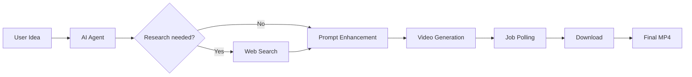
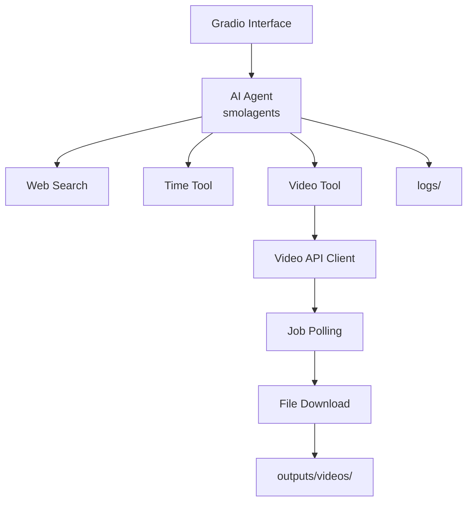
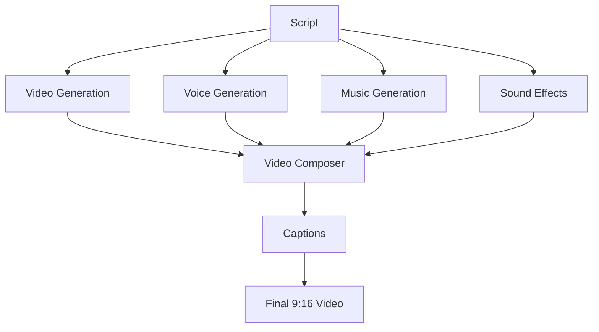
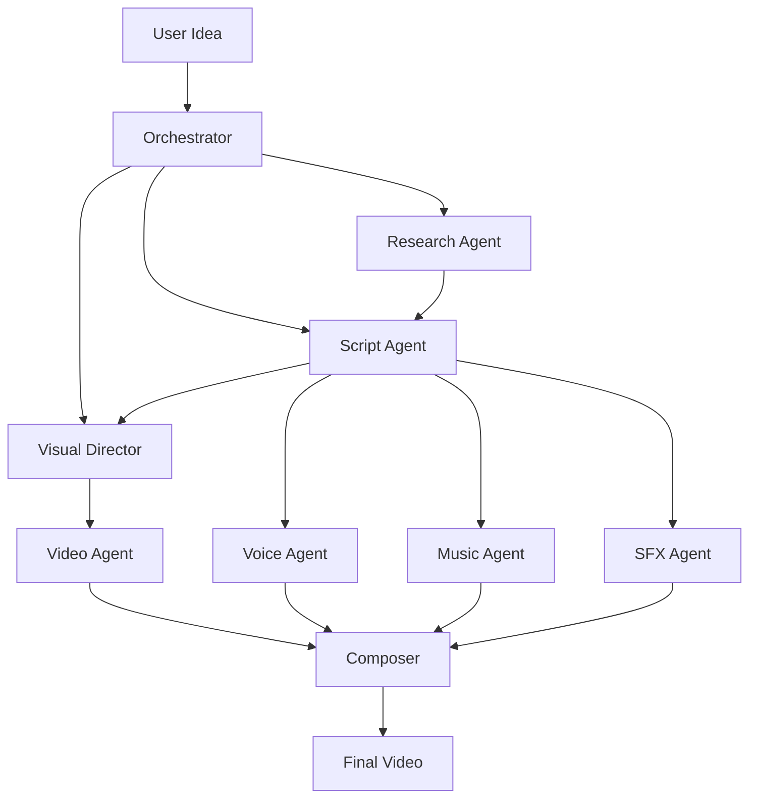
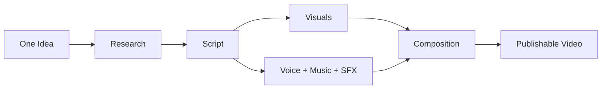

# Agentic Video Assistant

<p align="center">
  
  
  
  
</p>

<p align="center">
  <strong>Turn a simple idea into an AI-generated video.</strong>
</p>

<p align="center">
  An agentic AI application that researches ideas, enhances video prompts,
  orchestrates video generation, and returns the generated video.
</p>

---

## Overview

**Agentic Video Assistant** uses an LLM-powered agent to coordinate the video-generation workflow.

The user provides an idea, and the system handles the rest:



### Example

> Create an eerie cinematic video about the fear of being alone in the dark.

The agent turns the idea into a detailed generation prompt, submits it to the configured video API, waits for completion, and saves the result.

---

# Key Features

* **Agentic workflow** — LLM-powered tool selection and orchestration
* **Web research** — retrieves relevant information when needed
* **Prompt enhancement** — transforms simple ideas into detailed video prompts
* **Video generation** — integrates with an external video-generation API
* **Async job polling** — monitors long-running generation tasks
* **Automatic download** — saves generated videos locally
* **Gradio interface** — simple browser-based UI
* **Modular architecture** — separate agent, tools, services, and UI
* **Docker support** — ready for container deployment
* **Unit tests** — testable without unnecessary real API calls

---

# Architecture



The layers are intentionally separated so individual providers can be replaced without rewriting the entire application.

---

# Project Structure

```text
agentic-video-assistant/
│
├── app.py
├── agent/          # Agent logic and prompts
├── tools/          # Search, time and video tools
├── services/       # External API clients
├── config/         # Environment configuration
├── ui/             # Gradio interface
├── utils/          # Logging and helpers
├── tests/          # Unit tests
│
├── outputs/videos/ # Generated videos
├── logs/
│
├── .env.example
├── Dockerfile
├── requirements.txt
└── README.md
```

---

# Tech Stack

<p align="center">
  
</p>

* **Python**
* **smolagents**
* **Gradio**
* **DuckDuckGo**
* **External video-generation API**
* **Pytest**
* **Docker**

---

# Installation

### 1. Clone

```bash
git clone https://github.com/YOUR_USERNAME/agentic-video-assistant.git
cd agentic-video-assistant
```

### 2. Create environment

```bash
python -m venv .venv
```

Linux / macOS:

```bash
source .venv/bin/activate
```

Windows:

```powershell
.venv\Scripts\activate
```

### 3. Install dependencies

```bash
pip install -r requirements.txt
```

### 4. Configure secrets

```bash
cp .env.example .env
```

Configure:

```env
MODEL_ID=your_model
MODEL_API_KEY=your_llm_api_key

AGNES_API_URL=your_video_api_url
AGNES_API_KEY=your_video_api_key
```

> Never commit `.env` or expose API keys.

---

# Run

```bash
python app.py
```

Open:

```text
http://localhost:7860
```

### Tests

```bash
python -m pytest tests/ -v
```

---

# Audio & Full Video Pipeline

The current implementation focuses on **video generation**.

It does **not yet automatically provide**:

* Voiceover
* Character voices
* Background music
* Sound effects
* Captions
* Final audio mixing

These can be added as independent services:



This makes the current project a foundation for a complete automated short-form content pipeline.

---

# Multi-Agent Roadmap

The single agent can eventually evolve into specialized agents:



---

# Roadmap

### Core

* [x] Agentic video workflow
* [x] Web research
* [x] Prompt enhancement
* [x] Video generation
* [x] Async polling
* [x] Automatic download
* [x] Gradio UI
* [x] Docker support
* [x] Unit tests

### Planned

* [ ] Script generation
* [ ] Automatic hooks
* [ ] 9:16 short-form mode
* [ ] Text-to-speech
* [ ] Music generation
* [ ] Sound effects
* [ ] Automatic captions
* [ ] FFmpeg composition
* [ ] Multi-agent orchestration
* [ ] Video gallery and history
* [ ] Persistent storage

---

# Deployment

The project includes a `Dockerfile` and can be deployed to Docker-compatible platforms such as:

* Railway
* Render
* Hugging Face Spaces

Configure environment variables through the hosting platform.

For production, replace the placeholder video API endpoints in:

```text
services/agnes.py
```

with the actual API contract of your selected provider.

---

# Project Status

| Component              |  Status |
| ---------------------- | :-----: |
| Agent                  |  Ready  |
| Web Search             |  Ready  |
| Prompt Enhancement     |  Ready  |
| Video Generation       |  Ready  |
| Async Polling          |  Ready  |
| Gradio UI              |  Ready  |
| Docker                 |  Ready  |
| Tests                  |  Ready  |
| Voice / Music / SFX    | Planned |
| Captions / Composition | Planned |
| Multi-Agent System     | Planned |

---

# Vision

The goal is to evolve the system from:

```text
Idea → Video
```

into:



**One idea in. One finished video out.**

---

# Author

<p align="center">

<strong>Nadjiba Rahal</strong><br>
Intelligent Systems & Data Science<br>
École Supérieure d'Informatique — Algiers

</p>

<p align="center">
  <sub>Built with Python, smolagents, Gradio and generative AI.</sub>
</p>
